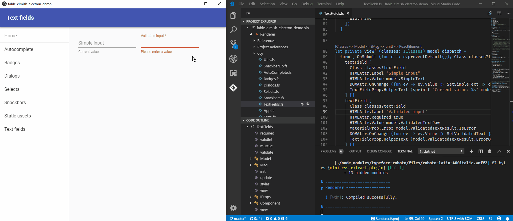
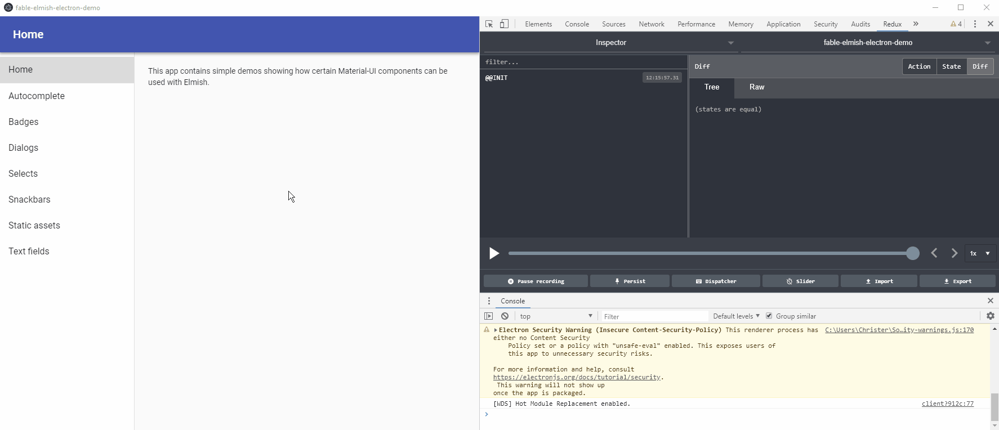

# Sphero MindWave Demo

- Connects to Sphero and Mindwave Mobile via bluetooth using Cylon.js.
- Moves the Sphero when the Mindwave indicates meditation.
- Runs on Ubuntu 18.04 with Node 10

## Running the project

- [Add your user to the dialout group](https://github.com/aolney/sphero.js) and REBOOT.
- Pair the devices in the bluetooth manager. They will show as disconnected
- You need their addresses. You can either get these from your bluetooth manager (double or right click the entry) or use `hcitool scan` to find the device addresses
- Run `sudo rfcomm connect 0 <sphero address> 1`
- Run `sudo rfcomm connect 1 <mindwave address> 1` in a different terminal
- Run `dotnet fake build` in the project folder. A faster version is `npm run dev`
- Hit the `Run demo` button

As long as the devices are connected to /dev/rfcomm0 and /dev/rfcomm1 respectively, both using channel 1, the demo project should connect to them.

## Troubleshooting

- The Sphero is blinking
    - You are not connected on rfcomm. Once it is connected, the Sphero will be solid blue
- The MindWave is blinking
    - You are not connected on rfcomm. Once it is connected, the MindWave LED will be solid blue
- The Sphero/Mindwave are connected, but the demo isn't doing anything
    - Check the console (Ctrl+Shift+i) of Electron.
    - The MindWave **should** read about once a second and will display the current meditation value. It **should** start as soon as you hit run demo. If it doesn't, turn the MindWave off/on, reconnect rfcomm, and restart the program.
    - Once the meditation is non-zero, the Sphero color should change based on the meditation value. If the meditation value is high enough, the Sphero will turn green and roll

Development instructions are below. Building for distribution using the packed installer generates an AppImage that has been tested to work. You'll want to `Ctrl+Shift+i` to see the console messages.

-----------------

## Development

This project is based on Fable-Elmish-Electron-Material-UI demo . The development instructions below are largely copied from that project.

This is an example of an F# Electron app centered around Fable 2 and Elmish. The actual app contents (which you can easily replace to build your own Electron app) are intended to show how to use Material-UI (including JSS/style-as-code) as well as serve as examples of how to implement some (not always trivial) UX patterns in Elmish.

To use the demo for scaffolding your own Fable/Elmish/Electron apps, simply clone the repo and start hackin' on the `Renderer` project to get started (details below).

Features/stack:
* Hot module reloading for both code and styles
* Time-travel debugging (using Redux DevTools, RemoteDev, and Fable.Elmish.Debugger)
* Single-command development and packaging with FAKE
* [electron-webpack](https://webpack.electron.build/) takes care of most of the webpack config
* [electron-builder](https://www.electron.build/) packages the app (see their documentation for how to customize)
* [electron-window-state](https://github.com/mawie81/electron-window-state/) for remembering window state between launches
* [Devtron](https://electronjs.org/devtron) for Electron-specific debugging/linting

Stuff demoed:

* Autocomplete
* Badges
* Dialogs
* Saving/loading files
* Selects (dropdowns)
* Snackbars
* Static assets (images etc.)
* Text fields / input validation

### Hot module reloading in action

### Time-travel debugging in action

## Requirements

* .NET Core SDK 3.0
* Node (for `npm`)

## How to develop

This project uses .NET Core 3 local tools. Therefore, run `dotnet tool restore` to restore the necessary CLI tools before doing anything else.

Then, to run the app locally in "live mode":

`dotnet fake build -t Dev`

(`Dev` is the default target, so you can also just run `dotnet fake build`.)

After the app starts, edit the renderer project in `/src/Renderer` and see the changes appear in real-time thanks to hot module reloading.

Place static files in the root `/static` folder as required by electron-webpack. See the code for the “Static assets” page (and the helpers in `Utils.fs`) to see how to use them.

### Release build to unpacked directory

`dotnet fake build -t DistDir`

### Release build to packed installer

`dotnet fake build -t Dist`

### NuGet package management

Use `dotnet paket` (after running `dotnet tool restore`).

## Improvements welcome!

If you see anything here that looks wrong, suboptimal or just weird, you may very well be right. Don't be shy about opening an issue or PR.
